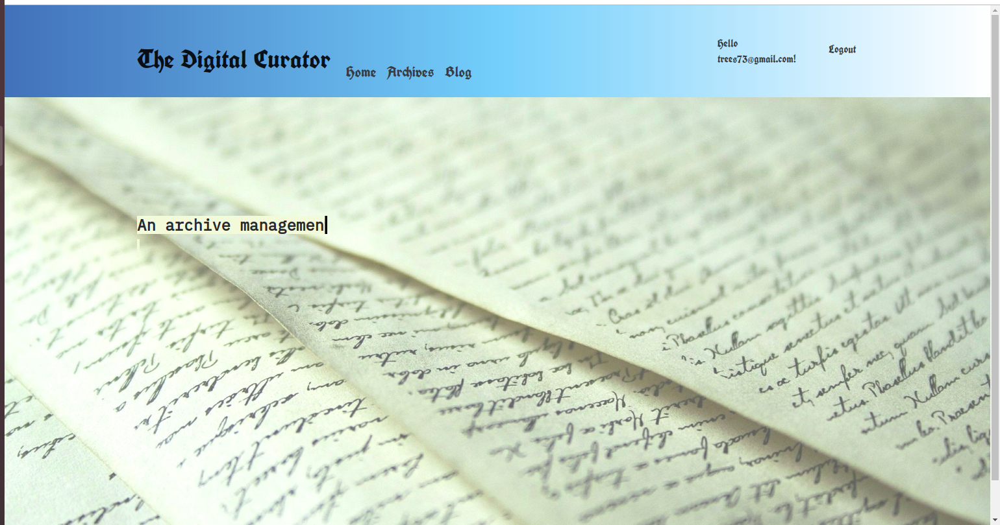
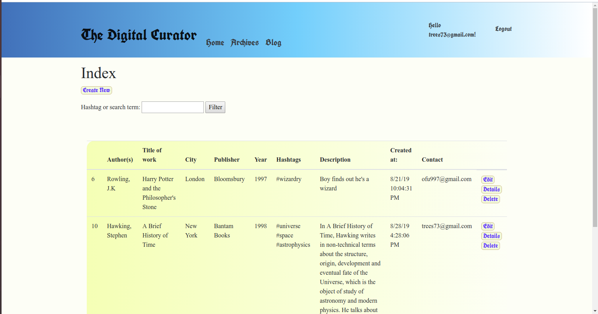

# Digital Archivist 
## a combined blog and bibliography catalog

#### Things I learned making this:
* Making an MVC project with multiple context databases
* Using the Identity package for authentication and authorization
* Enhancing my CSS styling and animation skills

#### How to use this app
* Anyone can see blog posts (/Posts/Index) and bibliography information (Archives/Index).
* A signed-in user can edit and delete their posts and archives.
* An admin can edit and delete any post or archive

#### Images

